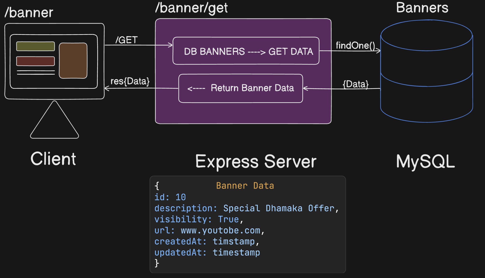
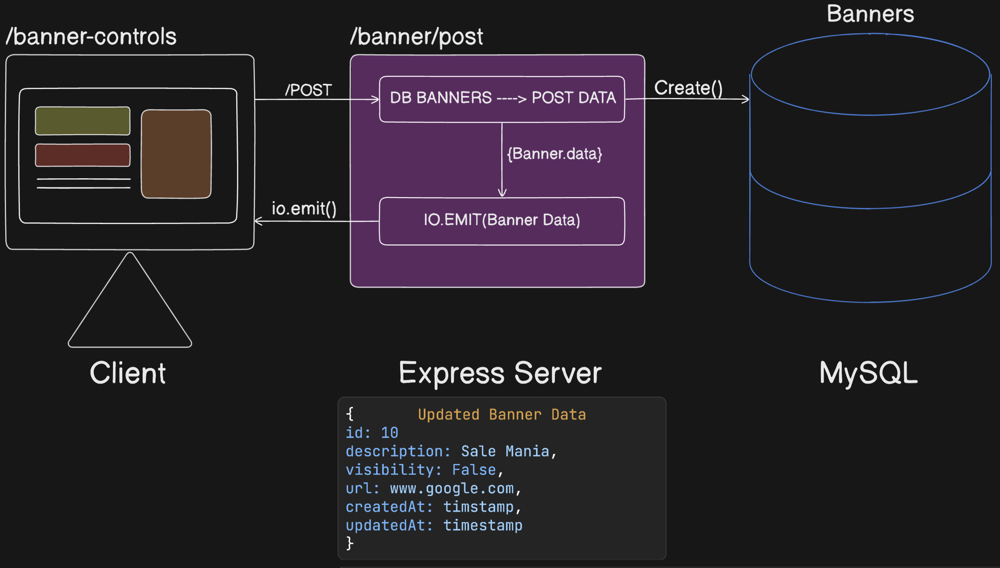

# Banner Management System

This project is a simple banner management system built with Node.js, Express, MySQL, and Socket.IO. It allows users to add and retrieve banner data via HTTP API endpoints, while also providing real-time updates to connected clients using WebSockets.

## Overview

This project demonstrates how to implement a basic banner management system using Express for server-side logic, MySQL for data persistence, and Socket.IO for real-time updates to clients. The system includes two main API endpoints: one for adding banners and one for retrieving the current banner data.

## Features

- **Add Banner**: Create or update a banner in the database and broadcast the updated banner data to all connected clients via WebSockets.
- **Get Banner**: Retrieve the current banner data from the database.
- **Real-Time Updates**: Clients connected via WebSocket receive real-time updates whenever the banner data changes.

## Let's understand the project

### Flow Overview

The Banner Management System involves both HTTP requests and real-time WebSocket connections. The basic flow is divided into two main parts: **adding/updating a banner** and **retrieving the current banner**. Let's walk through each of these flows:

### 1. **Add/Update Banner Flow**

**Objective**: To add a new banner or update an existing banner in the MySQL database and notify all connected clients of the change in real-time.

#### **Step-by-Step Breakdown**:

1. **Client Initiates Request**:
   - The client sends a `POST` request to the `/banner/add` endpoint with the banner details in the request body. The client interface could be a form where the user fills out details like `description`, `endTime`, `link`, and `visibility`.

2. **Server Receives and Processes Request**:
   - The Express server receives this `POST` request and triggers the corresponding controller function (`addBanner`).
   - The controller checks if a banner already exists in the database.
     - If a banner exists, it updates the existing record with the new data.
     - If no banner exists, it creates a new banner record in the MySQL database.

3. **Database Operation**:
   - The banner data is either updated or inserted into the MySQL `Banners` table. This table contains fields like `id`, `description`, `endTime`, `link`, `visibility`, `createdAt`, and `updatedAt`.

4. **Real-Time Update via WebSocket**:
   - After the banner is successfully added or updated in the database, the server uses `Socket.IO` to emit the updated banner data to all connected clients in real-time.
   - The WebSocket event `bannerUpdate` carries the updated banner data to ensure all clients have the most recent information.

5. **Client Receives Update**:
   - All clients connected via WebSocket receive the `bannerUpdate` event with the updated banner data. The client UI can then dynamically update to reflect the new banner without needing to refresh the page.

#### **Visual Flow**:

---

### 2. **Get Banner Flow**

**Objective**: To retrieve the current banner from the database and display it on the client's interface.

#### **Step-by-Step Breakdown**:

1. **Client Initiates Request**:
   - The client sends a `GET` request to the `/banner/get` endpoint to retrieve the current banner data.

2. **Server Processes Request**:
   - The Express server handles this `GET` request and triggers the corresponding controller function (`getBanner`).
   - The controller queries the MySQL `Banners` table to find the current banner (typically the most recently updated or created one).

3. **Database Operation**:
   - The server queries the `Banners` table using `findOne()` to fetch the banner data.

4. **Server Sends Response**:
   - The server sends back the banner data as a JSON response to the client.

5. **Client Receives Data**:
   - The client interface receives the banner data and displays it accordingly (e.g., showing the banner with the description, link, and visibility status).

#### **Visual Flow**:

---

### **Overall System Integration**:

The system is designed to allow seamless integration between HTTP requests and WebSocket updates. Here’s how everything works together:

- **HTTP Requests** handle the CRUD operations for the banner in the database.
- **WebSocket Events** keep all connected clients up-to-date in real-time without requiring them to refresh the page manually.

### **Scenarios**:
- **Adding/Updating a Banner**: When a user adds or updates a banner, all connected clients instantly see the change thanks to the WebSocket connection.
- **Retrieving a Banner**: At any time, a client can retrieve the most up-to-date banner data from the server, ensuring they have the latest information.

